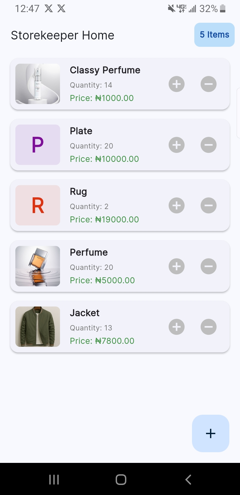

# 🏪 StoreKeeper - Flutter Inventory App

A simple, modern inventory management app built with **Flutter**.
Designed for **storekeepers and small business owners** (especially in Nigeria), this app allows easy tracking of products, stock levels, and inventory value — all stored **locally** on your device.

---

## 🚀 Quick Links

* **GitHub Repo:** [https://github.com/YOUR_USERNAME/YOUR_REPO_NAME](https://github.com/ALGO1822/my_storekeeper_app)
* **Demo Video:** [Watch a demo of the app in action.](https://www.youtube.com/YOUR_VIDEO_LINK)
* **Download APK:** [Click here to download the release APK.](https://github.com/YOUR_USERNAME/YOUR_REPO_NAME/releases/download/v1.0.0/app-release.apk)

---

## 📱 App Demo & Screenshots

* **Home Screen**
* **Add/Edit Product**
* **Inventory Summary**
  
> *(Add screenshots here using Markdown image syntax)*
`
> ``
> ``
> ``

---

## ✨ Features

### 🧾 Core

* **Full CRUD Functionality:** Easily Create, Read, Update, and Delete products.
* **Local Database:** Secure on-device storage using `sqflite` — no internet required.
* **State Management:** Stable and clean code architecture using `provider`.
* **Image Support:** Add product images directly from your camera or gallery.

### 🎨 Intuitive UI & UX

* **Tap-to-Edit:** Tap any product to open its edit screen.
* **Swipe-to-Delete:** Swipe to delete products with a confirmation dialog.
* **Hero Animations:** Smooth transitions from list to detail screens.
* **Quick Stock Update:** Instantly add or remove stock directly from the home screen.

### 📊 Inventory Summary Dashboard

* **Draggable Bottom Sheet** displaying key inventory stats.
* Calculates **Total Products**, **Total Units in Stock**, and **Total Inventory Value**.
* Displays a **Low Stock** list for items that need restocking.

### 🌍 Localization & Styling

* Correctly displays the **Naira (₦)** currency symbol.
* Uses **Inter (Google Font)** for clean typography and symbol support.
* **Responsive Design:** Adapts to different screen sizes with `flutter_screenutil`.
* **Form Validation:** Ensures all fields (name, quantity, price) are filled correctly.
* **Custom Notifications:** Clean, styled SnackBars for success/error messages.

---

## 📲 Download & Install (Release APK)

You can download the latest release APK directly from this repository.

➡️ **[Download the latest v1.0.0 APK](https://github.com/YOUR_USERNAME/YOUR_REPO_NAME/releases/download/v1.0.0/app-release.apk)**

> **Note:** After downloading, you may need to enable
> *“Allow installation from unknown sources”* in your Android device settings to install.

---

## 🛠️ Technologies Used

| Technology               | Description                                     |
| ------------------------ | ----------------------------------------------- |
| **Flutter**              | UI toolkit for building natively compiled apps  |
| **Dart**                 | The programming language used by Flutter        |
| **provider**             | For clean and efficient state management        |
| **sqflite**              | Local SQL database for offline storage          |
| **image_picker**         | Camera and gallery image support                |
| **flutter_screenutil**   | Responsive screen and font sizing               |
| **google_fonts (Inter)** | Beautiful, consistent typography with ₦ support |

---

## 👨‍💻 How to Build from Source

If you want to build the app yourself, follow these steps:

```bash
# Clone the repository
git clone https://github.com/YOUR_USERNAME/YOUR_REPO_NAME.git

# Navigate into the project directory
cd YOUR_REPO_NAME

# Install dependencies
flutter pub get

# Run the app
flutter run
```

---

## 🧑‍🏫 Author

**Favour Tomisin**
Flutter & Web Developer | Creative Designer
📧 [tomisinabayomi2007@gmail.com](mailto:tomisinabayomi2007@gmail.com)
🌍 [LinkedIn](https://linkedin.com/in/YOUR_PROFILE) • [GitHub](https://github.com/YOUR_USERNAME)
